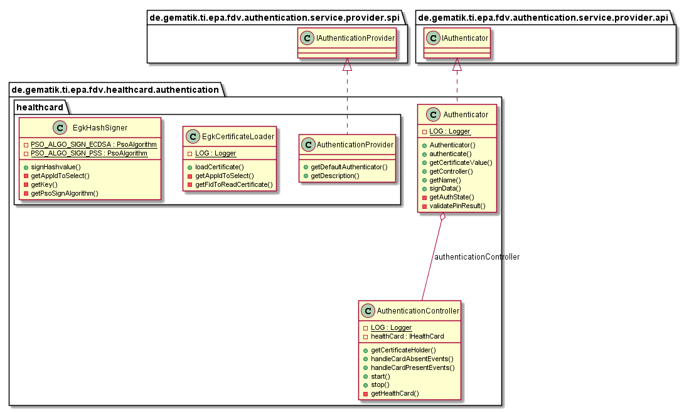

# HealthCardAuthentication Java Library

This part describes the HealthCardAuthentication functionalities and structure.

## API Documentation

Generated API docs are available at <https://gematik.github.io/ref-ePA-HealthCardAuthentication>.

## License

Licensed under the [Apache License, Version 2.0](https://www.apache.org/licenses/LICENSE-2.0).

## Overview

This library provides methods for authenticating the insured using his health card (eGK).

  

### Authenticator

The Authenticator class implements the IAuthenticator&lt;T&gt; interface which provides functionalities 'getCertificateValue' and 'signData'.
Owner of the certificate (certificate holder) is in this case the health card (eGK).
The certificate as a byte array can be achieved with 'getCertificateValue' from the health card.
A hashValue of byte-array can be signed by 'signData' which result will be returned back as 'AuthenticationResult'.

### AuthenticationController

The AuthenticationController class handles card events and returns the recognized health card as the certificate holder.

### Solution with health card (eGK)

A eGK of generation 2.0 or 2.1 should be used in this solution.
The certificate for eGK G2.0 is 'C\_CH\_AUT\_R2048', whereas for eGK G2.1 it is then 'C\_CH\_AUT\_E256'.
Details about signing are available in "gemSpec\_Frontend\_Vers" of ePA.

### Getting Started

#### Build setup

To use HealthCard Authentication in a project, you need just to include following dependency:

**Gradle dependency settings to use HealthCard Authentication.**

    dependencies {
        implementation group: 'de.gematik.ti.epa', name: 'fdv.healthcard.authentication', version: '1.0.0'
    }

**Maven dependency settings to use HealthCard Authentication.**

    <dependencies>
        <dependency>
            <groupId>de.gematik.ti.epa</groupId>
            <artifactId>fdv.healthcard.authentication</artifactId>
            <version>1.0.0</version>
        </dependency>
    </dependencies>
